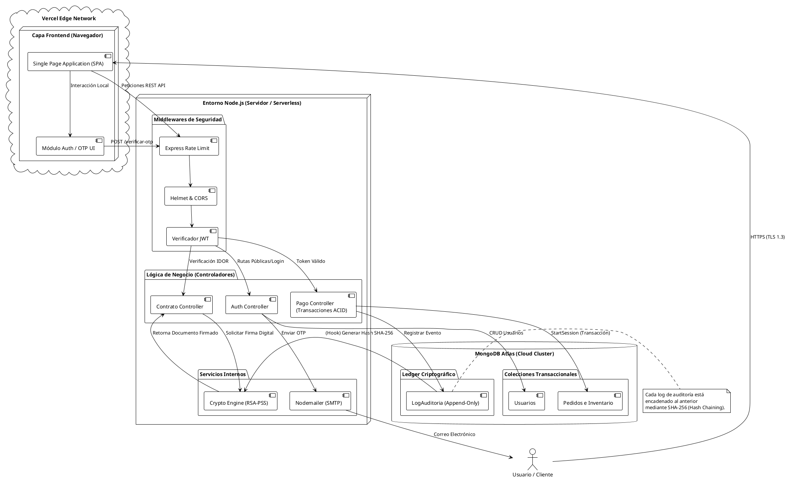

# Arquitectura Final del Sistema (Post-Modificaciones)

Este documento contiene el resumen de las integraciones aplicadas a la plataforma y el diagrama de infraestructura final modelado en **PlantUML**.

## Cambios Implementados en la Arquitectura
Durante la fusión final y las reparaciones de seguridad, la arquitectura del sistema **sí cambió**. Originalmente constaba solo de un Frontend, una API sencilla y MongoDB. Con las nuevas integraciones, la arquitectura evolucionó para incorporar módulos especializados:
1. **Módulo OTP y Correo (SMTP):** El backend ahora interactúa con servicios externos (Gmail SMTP vía Nodemailer) para completar el ciclo de 2FA.
2. **Sistema de Auditoría Inmutable (Hash Chaining):** Mongoose se configuró con hooks especiales e interacción con módulos nativos de criptografía (`crypto`) para generar un Ledger inmutable en la base de datos.
3. **Escudo Edge (Rate Limiting):** Se integró una barrera en la capa de red del backend (`express-rate-limit`) que actúa como un escudo previo a los controladores.
4. **Modal OTP (Frontend):** Se acopló un nuevo flujo asíncrono y componentes UI para manejar códigos de validación sin romper la SPA (Single Page Application).

---

## Código PlantUML de la Arquitectura

Puedes copiar este bloque y pegarlo en [PlantText.com](https://www.planttext.com/) o en un visor de VS Code para visualizar la topología de la aplicación.

